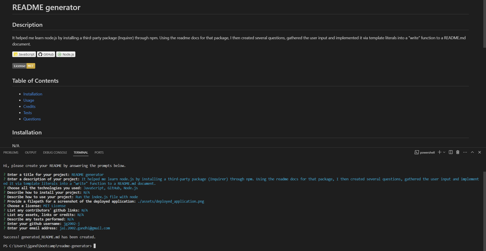

# README Generator
Challenge Week 11

# <README Generator>

## Description

This project helped me learn node.js by installing a third-party package (Inquirer) through npm. Using the readme docs for that package, I then created several questions, gathered the user input and implemented it via template literals into a "write" function to a [README.md document](./generated_README.md).

## Installation

[Node.js](https://nodejs.org/en) is required to run this application in the terminal.

## Usage

Run the `index.js` file with node on your computer.

See full walkthrough video [here](https://drive.google.com/file/d/1sKMw_5qA117Gvbda7VmB8wEZqXRL2E_N/view?usp=sharing)

## Credits

- [Inquirer](https://www.npmjs.com/package/inquirer)
- [Path](https://www.npmjs.com/package/path)
- [Screencastify](https://www.screencastify.com/)

## License

