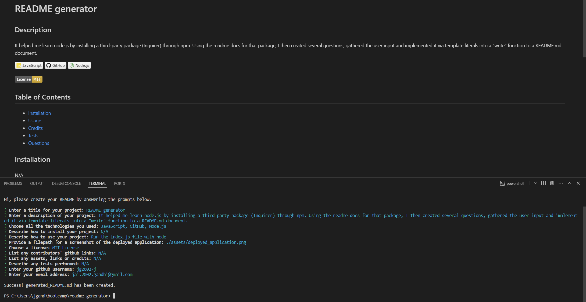

# README generator

## Description
It helped me learn node.js by installing a third-party package (Inquirer) through npm. Using the readme docs for that package, I then created several questions, gathered the user input and implemented it via template literals into a "write" function to a README.md document.

  

## Table of Contents
- [Installation](#installation)
- [Usage](#usage)
- [Credits](#credits)
- [Tests](#tests)
- [Questions](#questions)

## Installation
N/A

## Usage
Run the index.js file with node
	
	
## Contributors & Credits
### Contributors
N/A
### Credits
N/A

## Tests
N/A

## Questions
Please contact me if you have any questions:

 
		